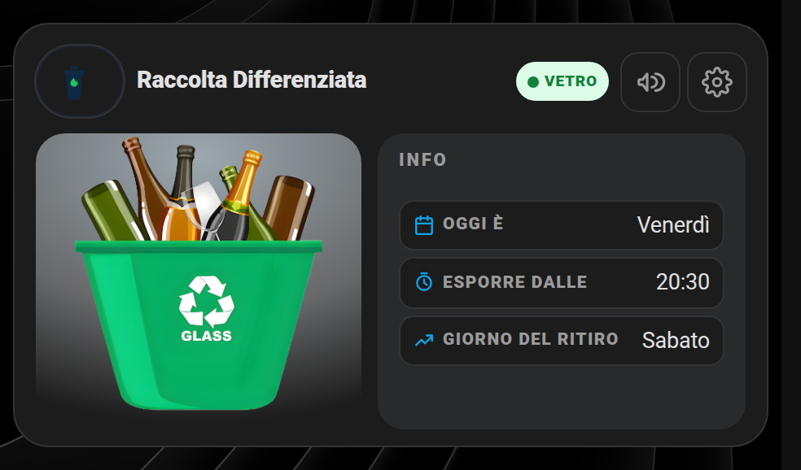
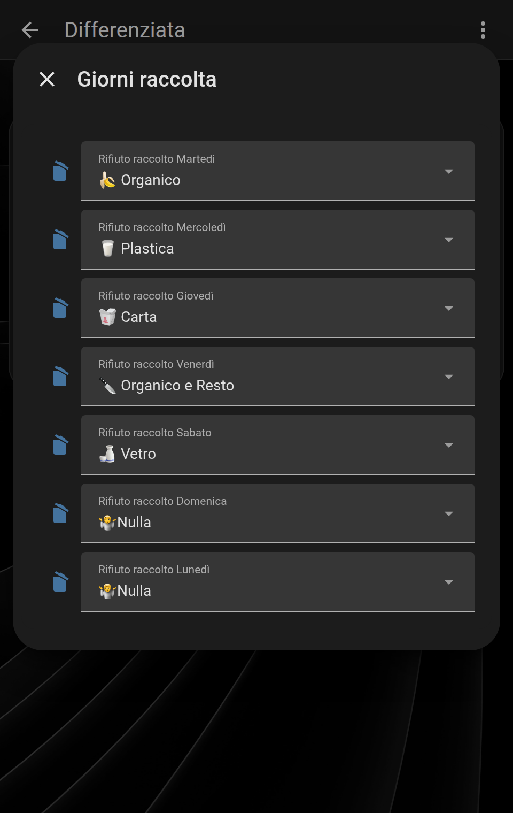
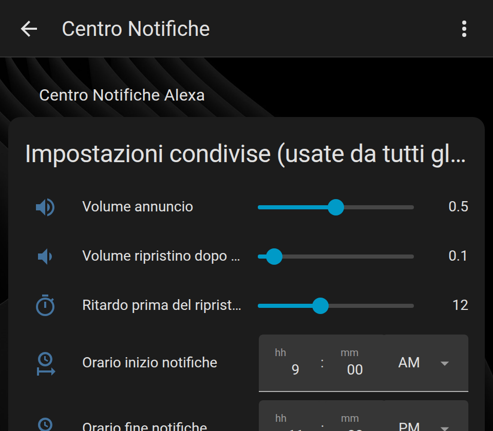

# ♻️ Svoz odpadu pro Home Assistant

Karta a package pro Home Assistant, které hlídají dny svozu odpadu: zobrazí obrázek podle druhu odpadu, den svozu, čas, kdy popelnici vystavit, odpočet do nejbližšího svozu — a posílají připomínku (push notifikace + vyskakovací oznámení v HA + hlasové hlášení), dokud ji nevypneš.

Starší projekt převzatý z karty, kterou jsem sdílel před časem (na základech od Saveria Gravagnoly a Agostina Pitasiho — další inspirace na [domoticamente.it](http://domoticamente.it) a v [scheccia1/hagarbage](https://github.com/scheccia1/hagarbage)). Přepsáno od nuly 18. 9. 2026: nová karta ve stylu „DashboardModern" (stejná grafická rodina jako moje další veřejné karty), čistý YAML package bez duplicit, ořezané a zostřené obrázky odpadu.

Tato karta patří do stejné grafické rodiny „DashboardModern" jako moje ostatní veřejné karty (spotřebiče, energie, FritzBox, HA server, NAS, Proxmox, UPS) — všechny pohromadě, ve stejném vizuálním stylu, najdeš v repozitáři **[smart-home-cards](https://github.com/Simonz82/smart-home-cards)**.

## Náhled

**Karta:**



**Tlačítko s ozubeným kolem → nastavení dnů:**



**Tlačítko s megafonem (volitelné) → tvoje sdílená stránka s hlasovými oznámeními:**



> Snímky obrazovky jsou ještě z původní italské verze — rozložení karty je stejné, jen texty jsou dnes české.

## Jak to funguje

- Každý den karta ukáže obrázek odpadu, který se má **dnes večer vystavit** (tj. ten, který se sváží zítra), název dnešního dne, den svozu a odpočet do nejbližšího svozu („Plast · zítra (úterý)").
- Automatizace zapne připomínku v nastavitelném časovém okně: dokud je aktivní, každých pár minut (podle tvého nastavení) přijde push notifikace, objeví se vyskakovací oznámení v Home Assistantu a případně se přehraje hlasové hlášení — pokud se dnes opravdu něco vystavuje.
- V push notifikaci jsou tlačítka **„Vyneseno ✅"** a **„Odložit o hodinu"**, takže připomínku zastavíš přímo z mobilu. To samé umí i tlačítko dole na kartě.
- Ozubené kolo vpravo nahoře otevře nastavení, kde přiřadíš druh odpadu každému dni v týdnu (dnešní den je v seznamu zvýrazněný).
- Megafon (volitelný) je pro ty, kdo chtějí mít nastavení hlasitosti/času hlášení Alexy na jedné sdílené stránce pro víc karet (viz sekce „Sdílená hlasová oznámení" níže) — když ho nepotřebuješ, prostě ho nenastavíš a nezobrazí se.

### Co je v české verzi navíc

| Funkce | Popis |
|---|---|
| 📅 **Zápis do kalendáře** | Každou noc se do tvého kalendáře (Místní kalendář / Local Calendar) založí celodenní událost „🚮 Svoz: Plast" na den svozu. Zapíná se přepínačem `input_boolean.svoz_odpadu_zapis_do_kalendare`. |
| 🔔 **Vyskakovací oznámení v HA** | Kromě push notifikace se připomínka objeví i ve zvonečku Home Assistantu a sama zmizí, jakmile potvrdíš vynesení. Přepínač `input_boolean.svoz_odpadu_vyskakovaci_oznameni`. |
| ✅ **Akční tlačítka v notifikaci** | „Vyneseno ✅" ukončí připomínání na dnešek, „Odložit o hodinu" ho jen odsune. O půlnoci se vše resetuje. |
| 🖼️ **Obrázek v push notifikaci** | Notifikace na mobilu ukáže rovnou obrázek správné popelnice. |
| 🚛 **Odpočet do příštího svozu** | Senzor `sensor.pristi_svoz` (druh odpadu + atributy `za_dni`, `datum`, `popis`) — karta ho zobrazuje v posledním řádku. |
| 🌅 **Ranní připomínka v den svozu** | Volitelné upozornění ráno („Dnes ráno jede svoz: Plast"), kdyby popelnice zůstala uvnitř. Přepínač `input_boolean.svoz_odpadu_ranni_pripominka`. |
| 🗣️ **Hlas i bez Alexy** | Hlasový kanál se přepíná pomocníkem `input_select.svoz_odpadu_hlasovy_kanal`: *Vypnuto*, *Alexa* nebo *TTS* (libovolný reproduktor přes Google/Piper/…). |
| 🗑️ **Sedmý druh odpadu** | Přibyl obrázek pro směsný odpad (`smesny.png`), takže má obrázek každá volba. |
| 🧪 **Testovací přepínač** | `input_boolean.svoz_odpadu_test_oznameni` je přímo součástí packagu — už si ho nemusíš zakládat ručně. |

## Instalace

1. **Karta**: v HA jdi do Nastavení → Řídicí panely → Zdroje a přidej soubor [`dm-garbage-card.js`](dm-garbage-card.js) jako JS zdroj. Nejjednodušší způsob: zkopíruj ho do `/config/www/dm-garbage-card.js` a přidej zdroj `/local/dm-garbage-card.js` typu „JavaScriptový modul". Žádná závislost na HACS: soubor je soběstačný.

2. **Package**: zkopíruj [`packages/svoz_odpadu.yaml`](packages/svoz_odpadu.yaml) do své složky `packages/` (pokud ještě packages nepoužíváš, přidej `packages: !include_dir_named packages` pod `homeassistant:` v `configuration.yaml`). Soubor [`packages/centrum_oznameni_alexa.yaml`](packages/centrum_oznameni_alexa.yaml) je **volitelný** — potřebuješ ho jen tehdy, když chceš hlášení přes Alexu (obsahuje sdílený skript `script.hlasove_oznameni_alexa`).

3. **Uprav jen tyhle řádky** v `packages/svoz_odpadu.yaml` (nahoře v sekci `setting`):
   - `Zarizeni pro push 1/2`: TVOJE entity `mobile_app_...` (Companion app v telefonu). Stačí jedna: pokud druhou nepotřebuješ, smaž ten řádek i odpovídající řádek `service: *push2` níže v bloku `notify:`.
   - `Kalendar pro svoz`: entita kalendáře, do kterého se má zapisovat (jen když chceš zápis do kalendáře — viz níže).
   - `Prehravac pro TTS` a `TTS entita`: jen když chceš hlásit přes TTS místo Alexy.
   - Zbytek (názvy druhů odpadu) můžeš nechat tak, jak je.

4. **Obrázky**: zkopíruj složku [`www/odpad/`](www/odpad/) do svého `/config/www/`. Je v ní 7 výchozích obrázků (Papír, Sklo, Plast, Bioodpad, Bio a směsný, Směsný odpad, Nic) — můžeš je nahradit vlastními, jen zachovej stejné názvy souborů nebo uprav cesty v konfiguraci karty (bod 6).

5. **Kalendář (volitelné)**: pokud chceš svozy vidět v kalendáři, přidej v Nastavení → Zařízení a služby → Přidat integraci → **Místní kalendář** kalendář s názvem např. „Svoz odpadu" (vznikne `calendar.svoz_odpadu`), nastav ho v sekci `setting` a zapni pomocníka „Svoz odpadu – zapisovat do kalendáře". Každou noc se pak založí celodenní událost na den svozu.

6. **Nastav kartu** ve svém dashboardu (režim YAML):
   ```yaml
   type: custom:dm-garbage-card
   entity: sensor.svoz_odpadu
   weekday_entity: sensor.den_v_tydnu
   pickup_day_entity: sensor.den_svozu
   next_pickup_entity: sensor.pristi_svoz
   done_entity: input_boolean.svoz_odpadu_vyneseno
   expose_time_entity: input_datetime.svoz_odpadu_zacatek_oznameni
   calendar_path: /calendar
   state_images:
     "Papír": /local/odpad/papir.png
     Sklo: /local/odpad/sklo.png
     Plast: /local/odpad/plast.png
     Bioodpad: /local/odpad/bio.png
     "Bio a směsný": /local/odpad/bio_a_smesny.png
     "Směsný odpad": /local/odpad/smesny.png
     Nic: /local/odpad/nic.png
   settings_sections:
     - title: Dny svozu
       rows:
         - entity: input_select.svoz_odpadu_po
           label: Pondělí
         - entity: input_select.svoz_odpadu_ut
           label: Úterý
         - entity: input_select.svoz_odpadu_st
           label: Středa
         - entity: input_select.svoz_odpadu_ct
           label: Čtvrtek
         - entity: input_select.svoz_odpadu_pa
           label: Pátek
         - entity: input_select.svoz_odpadu_so
           label: Sobota
         - entity: input_select.svoz_odpadu_ne
           label: Neděle
   ```
   S touhle konfigurací otevře ozubené kolo **nativní** okno (bez jakékoli další závislosti) se všemi 7 dny, jak je vidět na snímku výše.

   > Pomocník `input_select.svoz_odpadu_po` = **odpad, který se sváží v pondělí**. Co se má vystavit dnes večer, si karta dopočítá sama (bere svoz zítřejšího dne), takže dny nemusíš nikam posouvat.

### Volitelné parametry karty

| Parametr | Co dělá |
|---|---|
| `next_pickup_entity` | Přidá řádek „Příští svoz" s odpočtem. Když ho vynecháš, řádek se nezobrazí. |
| `done_entity` | Přidá tlačítko „Označit jako vyneseno" a pruh s připomínkou nad ním. |
| `calendar_path` | Zobrazí tlačítko kalendáře v záhlaví, které přejde na zadanou cestu (např. `/calendar`). |
| `alexa_settings_path` | Zobrazí tlačítko megafonu vedoucí na tvou stránku s nastavením hlasových oznámení. |
| `legacy_settings_popup` | Použije popup z `browser_mod` místo nativního okna (viz níže). |
| `name` | Nadpis karty (výchozí „Svoz odpadu"). |

### Sdílená hlasová oznámení (volitelné, pokročilé)

Package volá sdílený skript (`script.hlasove_oznameni_alexa` ze souboru `centrum_oznameni_alexa.yaml`) místo toho, aby se hlasitost/zařízení/prodleva duplikovaly v každé kartě: pokud máš další karty ze stejné rodiny (spotřebiče atd.), sdílejí všechny stejné nastavení Alexy, měnitelné na jednom místě. Když chceš i tlačítko megafonu, které na TU stránku vede, přidej do konfigurace karty:
```yaml
alexa_settings_path: /lovelace/nazev-tvoji-stranky
```
a nahraď cestou na svůj pohled/dashboard s kartou `entities` obsahující pomocníky z `centrum_oznameni_alexa.yaml` (`input_datetime.alexa_oznameni_zacatek/konec`, `input_number.alexa_hlasitost_oznameni` atd.). Když `alexa_settings_path` nenastavíš, tlačítko se prostě nezobrazí — všechno ostatní funguje stejně.

**Nemáš Alexu?** Přepni pomocníka „Svoz odpadu – hlasové hlášení" na `TTS` (a nahoře v `svoz_odpadu.yaml` nastav svůj reproduktor a TTS službu) nebo na `Vypnuto` — pak soubor `centrum_oznameni_alexa.yaml` vůbec nepotřebuješ.

### Pokud už používáš browser_mod

Máš-li integraci `browser_mod` z HACS a preferuješ její popup před nativním oknem, předej `legacy_settings_popup` místo `settings_sections`:
```yaml
legacy_settings_popup:
  service: browser_mod.popup
  data:
    title: Dny svozu
    content:
      type: entities
      entities:
        - entity: input_select.svoz_odpadu_po
        # ... zbylých 6 dnů
```

## Entity, které package vytvoří

| Entita | K čemu je |
|---|---|
| `sensor.svoz_odpadu` | Co se má dnes večer vystavit (hlavní entita karty). Atributy: `svoz_dnes`, `plan_tydne`. |
| `sensor.den_v_tydnu` | Název dnešního dne („Sobota"). |
| `sensor.den_svozu` | Název zítřejšího dne = den svozu. |
| `sensor.pristi_svoz` | Nejbližší svoz; atributy `za_dni`, `datum`, `popis`. |
| `binary_sensor.dnes_vystavit_popelnici` | `on`, když se dnes večer vystavuje a ještě to není potvrzené. |
| `input_select.svoz_odpadu_po … _ne` | Druh odpadu svážený v daný den. |
| `input_boolean.svoz_odpadu_vyneseno` | Potvrzení, že je popelnice venku. |
| `input_boolean.svoz_odpadu_k_oznameni` | Příznak „právě připomínat". |
| `input_boolean.svoz_odpadu_vyskakovaci_oznameni` | Zapíná oznámení ve zvonečku HA. |
| `input_boolean.svoz_odpadu_ranni_pripominka` | Zapíná ranní připomínku v den svozu. |
| `input_boolean.svoz_odpadu_zapis_do_kalendare` | Zapíná zápis do kalendáře. |
| `input_boolean.svoz_odpadu_test_oznameni` | Pošle testovací oznámení. |
| `input_select.svoz_odpadu_hlasovy_kanal` | Vypnuto / Alexa / TTS. |
| `input_number.frekvence_oznameni_svoz_odpadu` | Jak často připomínat (5–60 min). |
| `input_datetime.svoz_odpadu_zacatek_oznameni` / `_konec_oznameni` | Časové okno připomínek. |
| `input_datetime.svoz_odpadu_cas_ranni_pripominky` | Čas ranní připomínky. |
| `input_datetime.svoz_odpadu_odlozeno_do` | Dokdy je připomínka odložená („Odložit o hodinu"). |
| `script.svoz_odpadu_oznamit` | Pošle oznámení do všech kanálů (používají ho automatizace). |
| `script.svoz_odpadu_potvrdit_vyneseni` | Potvrdí vynesení a uklidí oznámení. |

## Struktura repozitáře

- `dm-garbage-card.js` — karta, soběstačná
- `packages/svoz_odpadu.yaml` — pomocníci, senzory, skripty a automatizace svozu odpadu
- `packages/centrum_oznameni_alexa.yaml` — volitelný sdílený skript pro hlasová hlášení Alexy (hlasitost/prodleva/čas)
- `www/odpad/` — výchozí obrázky odpadu (ořezané a optimalizované)
- `example/` — snímky obrazovky do tohoto README

## Changelog

- **19. 9. 2026**: česká verze. Přeložená karta, package i dokumentace; přejmenované entity a obrázky do češtiny. Novinky: zápis svozu do kalendáře, vyskakovací oznámení v HA, akční tlačítka „Vyneseno" / „Odložit o hodinu" v push notifikaci (včetně obrázku popelnice), tlačítko „Vyneseno" přímo na kartě, odpočet do příštího svozu (`sensor.pristi_svoz`), ranní připomínka v den svozu, hlasová hlášení i bez Alexy (TTS), obrázek pro směsný odpad, testovací přepínač přímo v packagu. Pomocníky pro dny už není potřeba posouvat o den — každý odpovídá dni, kdy se opravdu sváží.
- **18. 9. 2026**: kompletní přepis. Nová karta ve stylu DashboardModern (dříve karta `entities` + `button-card` přes HACS); vyčištěný package, žádné duplicitní nastavení Alexy (teď sdílené přes `centrum_oznameni_alexa.yaml`, stejný mechanismus jako u ostatních mých karet); obrázky odpadu ořezané na motiv a zostřené.


